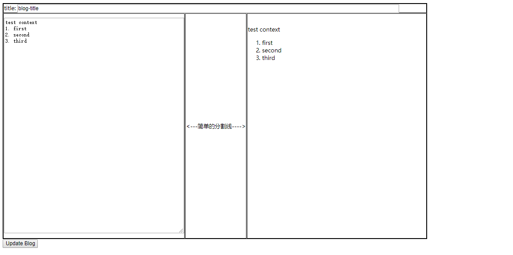

##### 链接数据库和CRUD #####
**分析**

如果你经历过java开发的话，那么分析一下java和mysql之间的链接，也许我们可以借鉴下，当前我们有如下角色：
1. mysql（MongoDB）
2. 后台语言Java(Js)

在java中，实现这个链接的一般有两种方式
1. Mybatis + MySQL Connector/J
2. Hibernate + MySQL Connector/J
3. xxxx + MySQL Connector/J

我们相信对于js连通MongoDB，也有类似的中间工具，没错，那就是--Mongoose。

1.安装一些依赖
```
npm i --save-dev body-parser cors
```
2. 安装mongoose
```
npm i mongoose --save-dev
```
3. 在server-dev.js中引入
```
//链接数据库
let bodyParser = require('body-parser');
let cors = require('cors');
let mongoose = require('mongoose');
//other code
//使用引入
//表示数据格式以json方式来传递？
app.use(bodyParser.json());
app.use(cors());
//服务器连接数据库，数据库不需要先建立
let DB_URL = "mongodb://localhost:27017/blogs";
mongoose.connect(DB_URL, {useNewUrlParser: true})
  .then(() => {
      console.log("connect successfully!")
    }, (err) => {
      console.log('error when connect to mongo db!' + err)
    }
  );
```
4. 为了能运行正常，你必须现在本地或者DB_URL的主机先安装了MongoDB。执行编译运行，如果正常的话，terminal会出现connect successfully.
接下来我们需要定义类似java中的链接bean对象--schema对象。新建文件夹./src/models，新建Blog.js,代码如下：
```
   let mongoose = require('mongoose');
   let Schema = mongoose.Schema;
   // import CommentModel from './Comment'

   let BlogSchema = new Schema({
     title: String,
     author: String,
     body: String,
     // comments: [CommentModel],
     date: {type: Date, default: Date.now},
   });

   module.exports = mongoose.model('BlogModel', BlogSchema);
```
在这里，我们可以先通过mongoose的[Api文档](https://mongoosejs.com/docs/index.html)了解schema,model,document,这里粗略的介绍下
- schema，行为何属性的定义集合（类似于java中的接口或者抽象类），它生成model
- model， 由schema调用生成，具有schema定义的属性和行为，但增加了一些公共的和mongodb交互的方法，可直接和mongodb交互（通常我们也是通过这个来交互的）
- document，model的一个是实例，保存数据，具有model的特性。

上面是连接数据库，下面是实现CRUD(增删改查)

0. 我们在后台接口router中引入blogModel，代码如下：
```
let BlogModel = require('../models/Blog.js');
```
1. Create:生成一个blog
    1. 新建一个vue页面，名字叫做，blog-add.vue,代码如下：
    ```
        <template>
        <div>
            <table>
                <tr>
                    <td colspan="3">
                        <label> title:</label>
                        <label>
                            <input type="text" v-model="blog.title" style="width: 90%">
                        </label>
                    </td>
                </tr>
                <tr>
                    <td>
                        <label>
                            <textarea v-model="blog.context" class="part"></textarea>
                        </label>
                    </td>
                    <td><label><---简单的分割线----></label></td>
                    <td>
                        <p v-html="convertMarkdown(blog.context)" class="part"></p>
                    </td>
                </tr>
            </table>
            <button class="btn btn-primary" v-if="!blog._id" @click="create()"><span>Create Blog</span></button>
            <button class="btn btn-primary" v-if="blog._id" @click="update()"><span>Update Blog</span></button>
        </div>
    </template>
     import {Converter} from 'showdown';
        import {ApiService} from "../js/apiService";
        import * as _ from "lodash";
    
        let converter = new Converter({tables: true});
        let apiService = new ApiService();
    
        // converter.setFlavor('github');
        let author = "asa.x";
    
        export default {
            name: "blog-add",
            data: function () {
                return {
                    blog: {
                        title: "blog-title",
                        context: "hello,world",
                        author: author,
                        id: null
                    },
                }
            },
            methods: {
                create() {
                    apiService.createBlog(this.blog).then(res => {
                        if (!res._id) {
                            window.alert("res:" + res.message);
                        } else {
                            <!--//页面跳转-->
                            this.$router.push({
                                path: '/blog-list',
                                name: 'BlogList'
                            })
                        }
                    })
                },
                //markdown文本转化
                convertMarkdown(context) {
                    return converter.makeHtml(context);
                },
                //初始化，update操作也在这个页面，暂时不管
                init() {
                    let vblog = this.$route.params.blog;
                    if (vblog) {
                        Object.assign(this.blog, vblog);
                    }
                },
                
            mounted() {
                this.init()
            }
        }
        </script>
        
        <style type="text/css" scoped>
        
        </style>
   ```
   重新打开页面，应该有两个框，再左边输入markdown文本，右边显示对应的普通文本。同时还有个createBlog按钮。
   
   2. 实现后台接口，在APIService中增加createBlog函数，代码如下：
   ```
       //插入
    createBlog(blog) {
        let url = `${API_URL}/blog-create/`;
        //返回一个promise对象给前端
        return axios.post(url, blog).then((res) => res.data);
    }
   ```
   这里只是通过axios代替ajax发送一个http请求，但是后端还没有接口来处理呢，我们需要在express-router中增加一个createBlog的接口。
   
   3. 在ex-router中增加如下接口
   ```
   router.route('/blog-create').post((request, response) => {
    console.log(request.body);
    let blog = new BlogModel();
    if (request.body) {
        Object.assign(blog, request.body)
    }
    blog.save().then((blog) => {
        console.log("----------> create successfully");
        response.status(200).json(blog);
    }).catch((err) => {
        response.status(400).send("error when saving to MongoDB");
    })
    });
   ```
   注意：在上面的代码中，我们调用了mongoose中Document中的api来保存数据
   ```
   blog.save()
   ```
   由于我们重写了后端，所以，我们需要重新编译后启动。
   启动后，我们可以保存数据到数据库中了,MongoDB数据查看推荐：NoSqlBooster for MongoDB.
   
2. Read(查看之查看博客列表）
    1. 在[日志8箱后台发送请求](https://github.com/GitHubsteven/x-asa/blob/master/daily/8.vwe%E5%BC%80%E5%8F%91%E4%B9%8Baxios%E5%90%91%E5%90%8E%E5%8F%B0%E5%8F%91%E9%80%81%E8%AF%B7%E6%B1%82.md)中，我们已经
    定义了查询所有blogs的express-router接口，只是数据是构造的，现在需要查询真正的数据，我们需要从MongoDB中读取数据，将blog-list的这个路径的
    接口代码如下：
    ```
     router.get('/blog-list', (req, res) => {
     //查询所有的数据
        BlogModel.find((err, blogs) => {
            if (err) {
                console.log(err);
            } else {
                res.json(blogs);
            }
        });
      });
    ```
    这个时候，重新编译后启动服务器，然后，点击list_blog页面，可以看到自己生成的blog
    <table data-v-6aa8c389=""><thead data-v-6aa8c389=""><tr data-v-6aa8c389=""><th data-v-6aa8c389="">title</th> <th data-v-6aa8c389="">context</th> <th data-v-6aa8c389="">author</th> <th data-v-6aa8c389="">createTime</th> <th data-v-6aa8c389="">operate</th></tr></thead> <tbody data-v-6aa8c389=""><tr data-v-6aa8c389=""><td data-v-6aa8c389="">blog-title</td> <td data-v-6aa8c389=""><p>test context</p>
    <ol>
    <li>first</li>
    <li>second</li>
    <li>third</li>
    </ol></td> <td data-v-6aa8c389="">asa.x</td> <td data-v-6aa8c389="">2019-06-18T00:04:45.752Z</td> <td data-v-6aa8c389=""><button data-v-6aa8c389="">Detail</button> <button data-v-6aa8c389="">Delete</button> <button data-v-6aa8c389="">Update</button></td></tr></tbody></table>
    
   上面的博客内容可以忽视，这里根据自己生成的博客内容显示而变化。
   为了方便后续步骤，我们增加了三个操作按钮Detail/delete/update，代码如下：
   ```
   <template>
    <div>
        <table>
            <thead>
            <tr>
                <th>title</th>
                <th>context</th>
                <th>author</th>
                <th>createTime</th>
                <th>operate</th>
            </tr>
            </thead>
            <tbody>
            <tr v-for="blog in blogs" v-bind:key="blog.id">
                <td>{{blog.title}}</td>
                <td>{{blog.context}}"></td>
                <td>{{blog.author}}</td>
                <td>{{blog.createTime}}</td>
                <td>
                    <button @click="detail(blog)">Detail</button>
                    <button @click="del(blog)">Delete</button>
                    <button @click="update(blog)">Update</button>
                </td>
            </tr>
            </tbody>
        </table>
    </div>
    </template>
    
    <script>
        //引入接口辅助类
        import {ApiService} from '../js/apiService.js'
        //定义一个对象
        const apiService = new ApiService();
        import {Converter} from 'showdown';
    
        let converter = new Converter({tables: true});
        // import {ApiService as apiService} from "../js/apiSerivce";
    
        export default {
            name: "blog-list",
            data() {
                return {
                    blogs: [],
                    numberOfBlogs: 0
                }
            },
            //定义方法
            methods: {
                getBlogs() {
                    //调用接口获取数据，并且更新vue页面数据
                    apiService.getBlogs().then((resp) => {
                        console.log(resp);
                        this.blogs = resp;
                        this.numberOfBlogs = resp.length;
                    });
                },
                convertMarkdown(context) {
                    return converter.makeHtml(context);
                },
                detail(blog) {
                    this.$router.push({
                        path: '/blog-view',
                        name: 'BlogView',
                        params: {
                            blogId: blog._id
                        }
                    })
                },
                del(blog) {
                    apiService.delBlog(blog._id).then(resp => {
                        if (resp) {
                            this.getBlogs();
                        } else {
                            window.alert("blank resp");
                        }
                    })
                },
                update(blog) {
                    this.$router.push({
                        path: "/blog-add",
                        name: "BlogAdd",
                        params: {
                            blog: blog
                        }
                    })
                }
            },
            //在vue被渲染的时候调用方法
            mounted() {
                this.getBlogs();
            }
        }
    </script>
    
    <style scoped>
    
    </style>
   ```
   
3. Read(查看单个博客内容)

    1. 增加一个view的vue组件，名称叫blog-view.vue，代码如下：
    ```
    <template>
    <div>
        <p>Blog View</p>
        <h3>{{this.blog.title}}</h3>
        <div v-html="this.blog.context"></div>
    </div>
    </template>
    
    <script>
        //引入接口辅助类
        import {ApiService} from '../js/apiService.js'
        //定义一个对象
        const apiService = new ApiService();
    
        import {Converter} from 'showdown';
    
        const converter = new Converter();
    
        export default {
            name: "blog-view",
            data() {
                return {
                    blog: {
                        title: "blog-title",
                        context: "blog-context"
                    }
                }
            },
            methods: {
                init() {
                    let id = this.$route.params.blogId;
                    apiService.viewBlog(id).then(resp => {
                        console.log(resp);
                        this.blog.title = resp.title;
                        this.blog.context = converter.makeHtml(resp.context);
                    })
                }
            },
            mounted() {
                this.init();
            }
        }
    </script>

    ```
    2. 在apiService中增加接口getBlog，代码如下：
    ```
      //查询
    viewBlog(id) {
        const url = `${API_URL}/blog-view/${id}`;
        return axios.get(url).then((res) => res.data);
    }
    ```
    3. 在ex-router.js中增加接口
    ```
    router.get('/blog-view/:id', (req, res) => {
    BlogModel.findById(req.params.id, (err, blog) => {
            if (err) {
                console.log(err);
            } else {
                res.json(blog);
            }
        })
    });
    ```
    重启服务器，刷新页面，点击detail，跳转到博客详情
    
    <div><p>Blog View</p> <h3>blog-title</h3> <div><p>test context</p>
    <ol>
    <li>first</li>
    <li>second</li>
    <li>third</li>
    </ol></div></div>
    
 4. 修改（Update)：修改博客
 
    在一定程度上修改和生成是一样的，区别在于是否有id（只限定于这里），所以我们的update界面在blog-add.vue中，在不修改vue的html内容，我们增加
    一个函数updateBlog到blog-add.vue的JavaScript代码中，代码如下：
    ```
     update() {
                let oldBlog = this.$route.params.blog;
                if (oldBlog.title === this.blog.title
                    && oldBlog.context === this.blog.context
                    && oldBlog.author === this.blog.author) {
                    window.alert("there is no change!");
                    return;
                }
                apiService.update(this.blog).then((resp) => {
                    if (!resp) {
                        window.alert("update failed!");
                    }
                    this.$router.push({
                        path: '/blog-view',
                        name: 'BlogView',
                        params: {
                            blogId: oldBlog._id
                        }
                    })
                }, (error) => {
                    console.log(error);
                    window.alert("update failed!");
                });
            },
    ```
    在blog-add.vue中，如下代码控制是Add还是update
    ```
        <button class="btn btn-primary" v-if="!blog._id" @click="create()"><span>Create Blog</span></button>
        <button class="btn btn-primary" v-if="blog._id" @click="update()"><span>Update Blog</span></button>
    ```    
    
    2. apiService.js中增加updateBlog的接口，代码如下：
    ```
      //更新，调用put方法，表示修改数据
    update(blog) {
        let url = `${API_URL}/blog-update/${blog._id}`;
        return axios.put(url, blog).then((res) => res.data)
    }
    ```
    
    3. 在ex-router.js中增加路由
    ```
    //更新博客
    router.route("/blog-update/:id").put((req, res) => {
        BlogModel.findByIdAndUpdate(req.params.id, req.body, {useFindAndModify: true}, (err, todo) => {
            console.log(err);
            console.log(todo);
            if (err) {
                res.json(err)
            } else {
                res.json(todo);
            }
        })
    });
    ```
    
    重启服务，在blog-list中点击update,显示如下：
    
    
    
    修改title为 test-ol,点击updateBlog，直接跳转到blog-view页面，显示如下：
    <div><p>Blog View</p> <h3>test-ol</h3> <div><p>test context</p>
    <ol>
    <li>first</li>
    <li>second</li>
    <li>third</li>
    </ol></div></div>

5. Delete:删除博客
    1. 在blog-list.vue中，已经有代码了，JavaScript代码如下：
    ```
     del(blog) {
                apiService.delBlog(blog._id).then(resp => {
                    if (resp) {
                        this.getBlogs();
                    } else {
                        window.alert("blank resp");
                    }
                })
            },
    ```
    2. 在apiService.js中，增加如下代码：
    ```
        //删除，调用delete表示删除数据
    delBlog(id) {
        let url = `${API_URL}/blog-delete/${id}`;
        return axios.delete(url);
    }
    ```
    3. 在ex-router中增加路由：
    ```
    router.route("/blog-delete/:id").delete((req, res) => {
    BlogModel.findByIdAndRemove({_id: req.params.id}, {useFindAndModify: true}, (err, todo) => {
            console.log("delete %o", todo);
            if (err) {
                res.json(err);
            } else {
                res.json("delete successfully!");
            }
        })
    });
    ```
    重启服务器，在blog-list中点击delete，删除后会直接刷新页面，没有这条数据了。
    
    
 最后apiService.js的代码如下：
 ```
 //导入axios
import axios from 'axios'
//定义主机，定义别的主机可能会报跨域错误
const API_URL = "http://localhost:8090";

//定义并且曝光出一个类
export class ApiService {
    constructor() {
    }

//定义一个方法查询
    getBlogs() {
        const url = `${API_URL}/blog-list/`;
        return axios.get(url).then((res) => res.data);
    }

    //查询
    viewBlog(id) {
        const url = `${API_URL}/blog-view/${id}`;
        return axios.get(url).then((res) => res.data);
    }

    //插入
    createBlog(blog) {
        let url = `${API_URL}/blog-create/`;
        return axios.post(url, blog).then((res) => res.data);
    }

    //删除，调用delete表示删除数据
    delBlog(id) {
        let url = `${API_URL}/blog-delete/${id}`;
        return axios.delete(url);
    }

    //更新，调用put方法，表示修改数据
    update(blog) {
        let url = `${API_URL}/blog-update/${blog._id}`;
        return axios.put(url, blog).then((res) => res.data)
    }
}
 ```
 
 ex-router.js的代码如下：
 ```
 /* eslint-disable no-console */
let express = require('express');
let BlogModel = require('../models/Blog.js');
let router = express.Router();

module.exports = router;

router.all((req, res, next) => {
    console.log("request receive time: " + new Date().toDateString());
    next();
});

router.get('/blog-list', (req, res) => {
    BlogModel.find((err, blogs) => {
        if (err) {
            console.log(err);
        } else {
            res.json(blogs);
        }
    });
});

router.get('/blog-view/:id', (req, res) => {
    BlogModel.findById(req.params.id, (err, blog) => {
        if (err) {
            console.log(err);
        } else {
            res.json(blog);
        }
    })
});

router.route('/blog-create').post((request, response) => {
    console.log(request.body);
    let blog = new BlogModel();
    if (request.body) {
        Object.assign(blog, request.body)
    }
    blog.save().then((blog) => {
        console.log("----------> create successfully");
        response.status(200).json(blog);
    }).catch((err) => {
        response.status(400).send("error when saving to MongoDB");
    })
});
router.route("/blog-delete/:id").delete((req, res) => {
    BlogModel.findByIdAndRemove({_id: req.params.id}, {useFindAndModify: true}, (err, todo) => {
        console.log("delete %o", todo);
        if (err) {
            res.json(err);
        } else {
            res.json("delete successfully!");
        }
    })
});

//更新博客
router.route("/blog-update/:id").put((req, res) => {
    BlogModel.findByIdAndUpdate(req.params.id, req.body, {useFindAndModify: true}, (err, todo) => {
        console.log(err);
        console.log(todo);
        if (err) {
            res.json(err)
        } else {
            res.json(todo);
        }
    })
});
 ```
 
 这里就实现了一个简单的MongoDB的CRUD开发。
 


